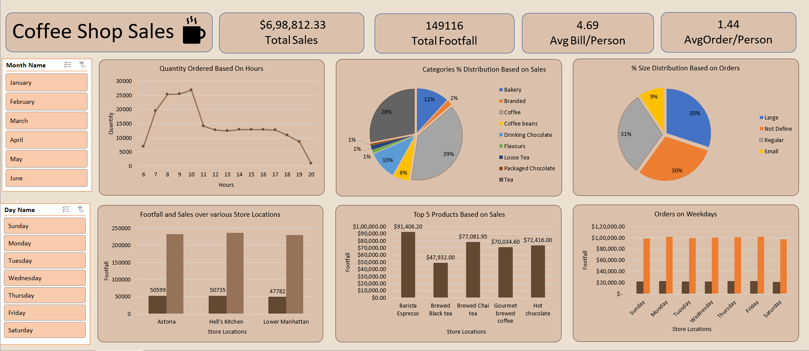

<h1> Coffee-Shop-DashBoard</h1>

🚀 𝐄𝐱𝐜𝐢𝐭𝐢𝐧𝐠 𝐍𝐞𝐰𝐬! 🚀

I'm thrilled to share my latest data analysis project: the Coffee-Shop-Sales Dashboard! This interactive dashboard, developed using Excel and offers an in-depth look to the Coffee-Shop In the Year 2023.

𝐏𝐫𝐨𝐛𝐥𝐞𝐦 𝐒𝐭𝐚𝐭𝐞𝐦𝐞𝐧𝐭:
The main objective of this project is to analyze retail sales data to gain actionable insights that will enhance the performance of the Coffee Shop.

𝐊𝐞𝐲 𝐅𝐞𝐚𝐭𝐮𝐫𝐞𝐬:

1. 📋 KPI Dashboard for Total Sales, Avg. Bill/Person, Avg. Order/Person
• Value Based on the Analysis.

2. 🔄 Slicer for Months and Day
• Filter data by state for a more granular view.

3. 📊 Clusters Column Charts for Revenue Distribution, Sales, Stores and Order.
• Visualize and compare Revenue distribution across different Product, Sales, Stores and Order.

4. 📈 Line Chart for Quantity of Order Hourly
• Analyze Order over the time with engaging visuals.

5. 🍩 Donut Chart for % of Category Distribution and Based on Sales and Order
• Intuitive understanding of Order and Sales distribution among categories.

 

𝐈𝐧𝐬𝐢𝐠𝐡𝐭𝐬:
 
•	Discover how do sales vary by day of the week and hour of the day.
•	Peak time for sales Activity by day and Week.
•	Total Sales Revenue of each Day and Month.
•	Total sales vary across different store locations.
•	The average price/order per person
•	Best-selling Product in terms of quantity and revenue.
•	sales vary by product category and type

𝐀𝐧𝐚𝐥𝐲𝐬𝐢𝐬:
1. KPI Dashboard for Total Sales, Avg. Bill/Person, Avg. Order/Person
• Final Data: Dive deeper into the specifics of Total Sales, Order, Avg. Bill per Person and Avg. Order per Person.

2. Slicer for Month and Day
• Final Data: Understand Month and Day-specific Sales patterns and identify Orders

3. Clusters Column Charts for Revenue Distribution, Sales, Stores and Order.
• Final Data: Easily identify Top 5 Product with Most Sales, and Sales Over various Stores.

4. Line Chart for Quantity of Order Hourly
• Final Data: Observe changes in voter turnout and preferences between different election years.

5. Donut Chart for % of Category Distribution and Based on Sales and Order
• Final Data: Gain a quick visual comparison of the total categories of Sales and Order.

A huge thanks to WsCube Tech for their guidance on this project!

𝐂𝐡𝐞𝐜𝐤 𝐢𝐭 𝐨𝐮𝐭 𝐨𝐧 𝐆𝐢𝐭𝐇𝐮𝐛: https://shorturl.at/8nFg
